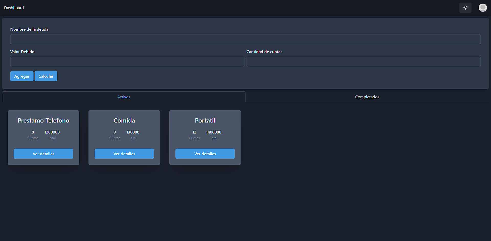
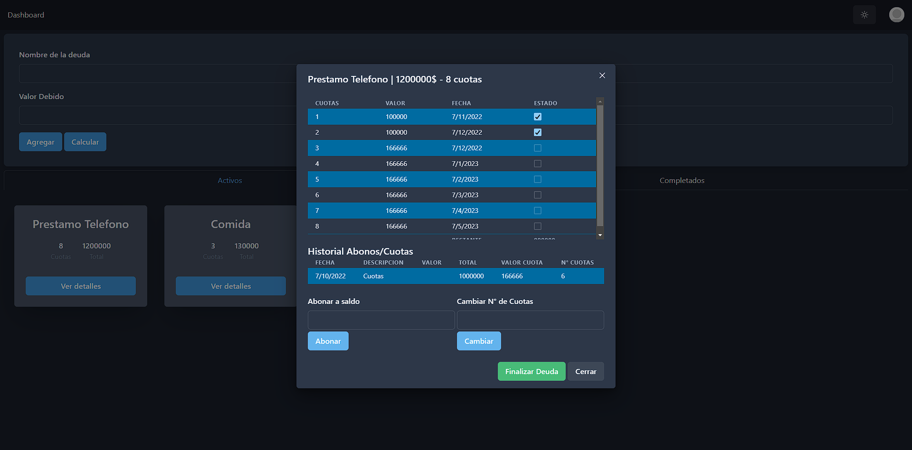

# Debt's App

Una aplicación de gestión de deudas construida con React y Firebase para rastrear y administrar deudas.

## Características

- **Autenticación de Usuario:** Gestiona tus deudas de manera segura con la autenticación de usuario proporcionada por Firebase.
- **Seguimiento de Deudas:** Realiza un seguimiento de las deudas pendientes y las deudas a tu favor.
- **Actualizaciones en Tiempo Real:** Observa instantáneamente los cambios en las deudas con la sincronización en tiempo real a través de Firebase.
- **Persistencia de Datos:** Almacena información de deudas de manera confiable con la base de datos en la nube de Firebase.

## Capturas de Pantalla





1. Clona este repositorio:

```bash
git clone https://github.com/your-username/Debts-App.git
```

2. Navega al directorio del proyecto: `cd Debts-App`

3. Instala las dependencias: `npm install`

4. Configura Firebase:
   
   - Crea un proyecto en Firebase en [Firebase Console](https://console.firebase.google.com/).
   - Copia la configuración de Firebase y reemplázala en el archivo `src/config/firebase.js`.

5. Inicia la aplicación: `npm start`

6. Abre tu navegador y visita `http://localhost:5173` para ver la aplicación.

## Contribuir

¡Las contribuciones son bienvenidas! Si tienes ideas para nuevas características, mejoras o encuentras problemas, por favor crea un issue o envía un pull request.
